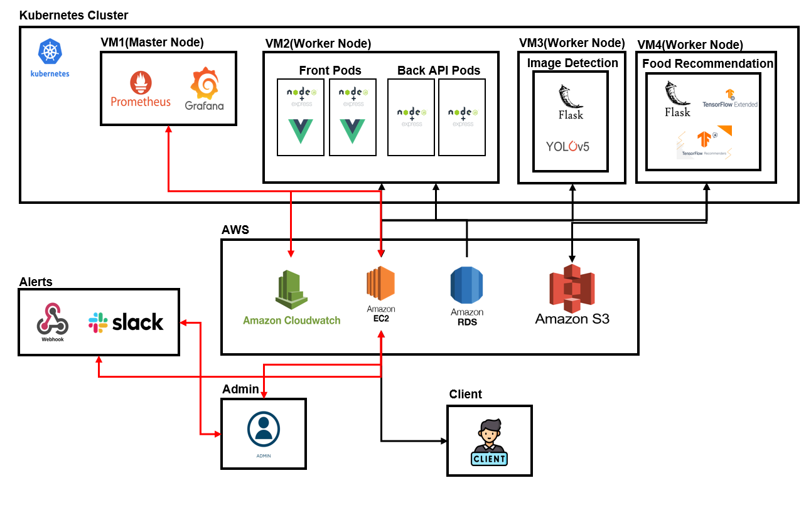
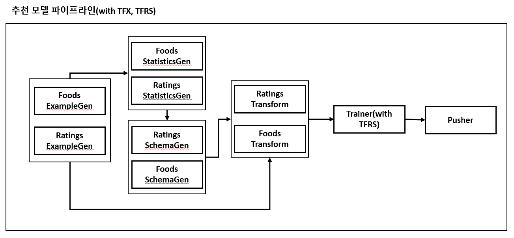
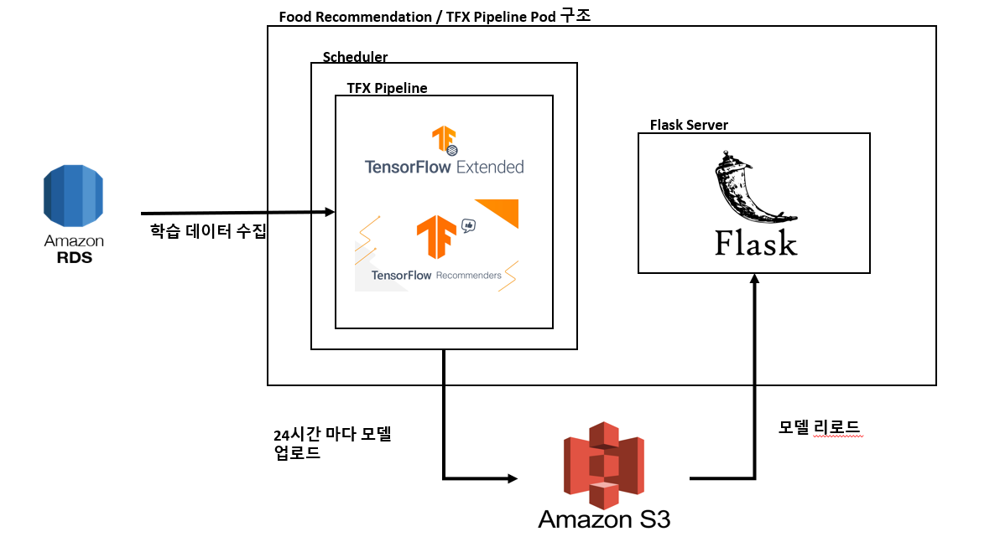
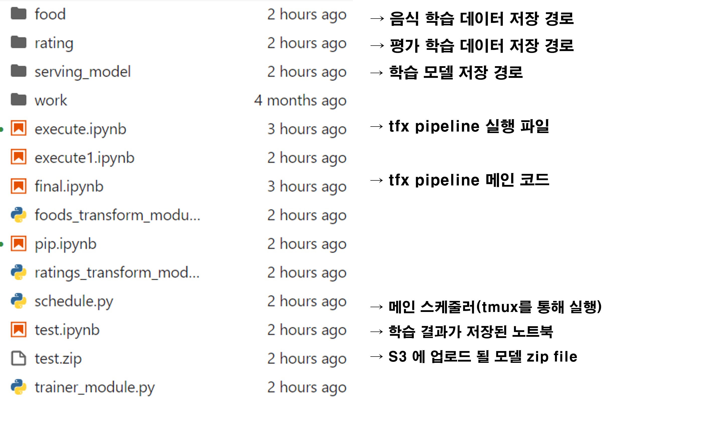

# meal_plan_pr_public

 일단 식단 프로젝트 배포용  

# Stack  

    </a>&nbsp
    </a>&nbsp
     
    </a>&nbsp
    </a>&nbsp
     
    </a>&nbsp
    </a>&nbsp
    </a>&nbsp
     
    </a>&nbsp
     
    </a>&nbsp
    </a>&nbsp
    </a>&nbsp
    </a>&nbsp
     
    </a>&nbsp
    </a>&nbsp
     
    </a>&nbsp
    </a>&nbsp
    </a>&nbsp
    </a>&nbsp

# Service Cluster 

 

# 추천 모델(with TFX TFRS)

## 추천 모델 구조  

 

## TFX(pipeline) 구조

 

## TFX(pipeline) 스케줄러

  
 